# Nuesara Inventory - OneTwoThree

Repository ini berisi implementasi sistem informasi inventaris bahan baku berbasis Odoo 17 untuk kebutuhan Tugas Besar IF3141 Sistem Informasi.

## Identitas Kelompok

| Keterangan | Nilai |
| --- | --- |
| Nama Kelompok | OneTwoThree |
| Nomor Kelompok | G02 |
| Nomor Kelas | K01 |

## Anggota Kelompok

| NIM | Nama |
| --- | --- |
| 13523008 | Varel Tiara |
| 13523017 | Orvin Andika Ikhsan Abhista |
| 13523020 | Stefan Mattew Susanto |
| 13523028 | Muhammad Aditya Rahmadeni |
| 13523035 | M. Rayhan Farrukh |

## Informasi Sistem

| Keterangan | Nilai |
| --- | --- |
| Nama Sistem | Nuesara Inventory |
| Nama Perusahaan | Nuesara Coffee & Habitual |
| Platform | Odoo 17 |
| Modul Utama | `nuesara_inventory` |

## Deskripsi Sistem

Nuesara Inventory adalah sistem informasi inventaris bahan baku yang dirancang untuk membantu Nuesara Coffee & Habitual dalam mengelola ketersediaan stok operasional bar dan kitchen. Sistem ini berfokus pada pencatatan bahan baku, penerimaan stok dari supplier, pemakaian harian, pemantauan status stok, permintaan pengadaan, serta pelaporan penggunaan bahan baku. Implementasi dilakukan sebagai modul kustom Odoo dengan nama `nuesara_inventory`, sehingga sistem dapat memanfaatkan fitur dasar Odoo seperti autentikasi, manajemen pengguna, menu, tampilan data, dan basis data PostgreSQL.

Sistem menerapkan pembagian akses berdasarkan role agar setiap pengguna hanya dapat membuka fitur yang sesuai dengan tanggung jawabnya. Admin dapat mengelola master bahan baku dan konfigurasi threshold, Head Divisi dapat memantau dashboard serta mencatat stok masuk dan permintaan pengadaan, Staf Bar & Kitchen dapat mencatat pemakaian harian, Finance dapat melihat laporan harian, sedangkan Owner dapat melihat laporan harian dan bulanan. Dengan pembagian ini, proses operasional inventaris menjadi lebih terstruktur, mudah diaudit, dan mendukung pengambilan keputusan terkait kebutuhan pengadaan bahan baku.

## Prasyarat

Sebelum menjalankan sistem, pastikan perangkat sudah memiliki:

1. Docker Desktop
2. Git
3. Browser seperti Google Chrome, Microsoft Edge, atau Mozilla Firefox

Python 3.11 dan virtual environment hanya diperlukan apabila pengembang ingin melakukan validasi atau pengembangan modul secara lokal di luar container Odoo.

## Cara Menjalankan Sistem

### 1. Clone repository

Jalankan perintah berikut untuk mengambil repository ke komputer lokal.

```bash
git clone https://github.com/grwna/IF3141-Implementasi-K01-G02.git
cd IF3141-Implementasi-K01-G02
```

Expected result: folder proyek berhasil dibuat dan berisi file `docker-compose.yml`, folder `custom_addons`, folder `config`, dan folder `scripts`.

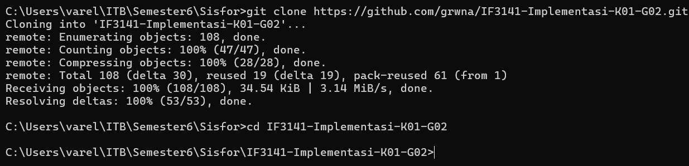

### 2. Jalankan service Odoo dan PostgreSQL

Jalankan container aplikasi dan database menggunakan Docker Compose.

```bash
docker compose up -d
```

Expected result: service `web`, `db`, dan `alpine` berjalan tanpa error. Odoo dapat diakses melalui port `8069`.

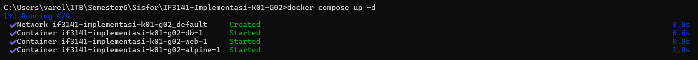
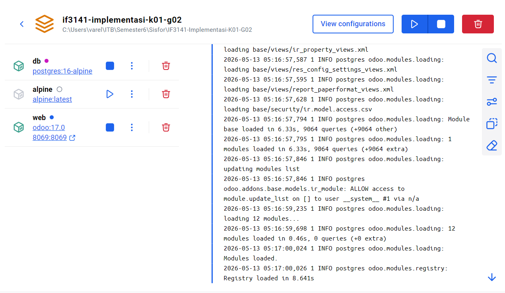

### 3. Buka Odoo di browser

Buka alamat berikut pada browser.

```text
http://localhost:8069
```

Expected result: halaman login Odoo tampil pada browser.

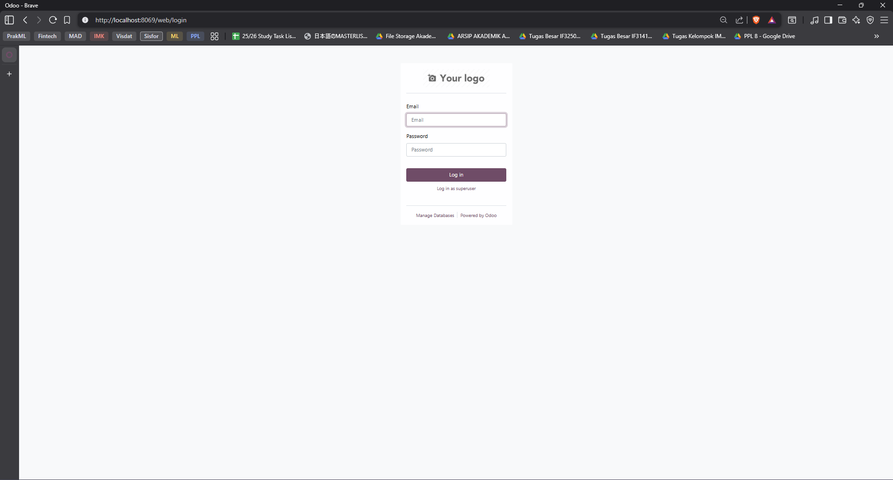

### 4. Login sebagai administrator Odoo

Masuk menggunakan kredensial administrator awal berikut.

| Field | Nilai |
| --- | --- |
| Username | `admin` |
| Password | `admin` |

Expected result: pengguna berhasil masuk ke halaman utama Odoo.

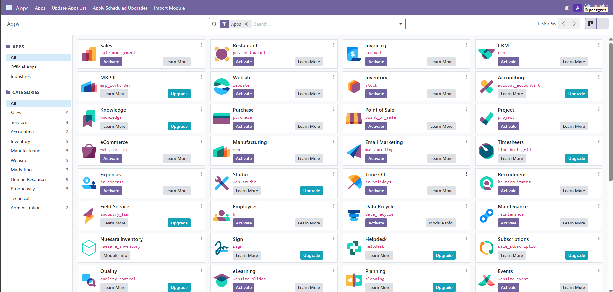

### 5. Aktifkan mode developer

Buka menu **Settings**, lalu aktifkan **Developer Mode**.

Expected result: mode developer aktif dan menu teknis Odoo dapat digunakan untuk memperbarui daftar aplikasi.

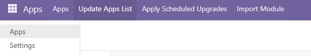
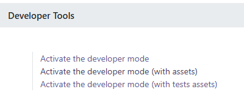

### 6. Perbarui daftar aplikasi

Buka menu **Apps**, lalu pilih **Update Apps List**.

Expected result: Odoo membaca ulang daftar modul dari folder `custom_addons`, termasuk modul `Nuesara Inventory`.

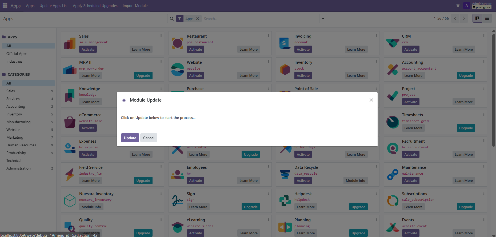

### 7. Install modul Nuesara Inventory

Pada menu **Apps**, cari `Nuesara Inventory`, lalu klik **Activate** atau **Install** atau **Upgrade**.

Expected result: modul `Nuesara Inventory` berhasil terpasang dan menu **Nuesara Inventory** muncul pada halaman utama Odoo.

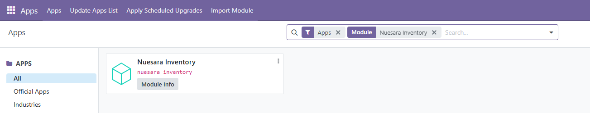
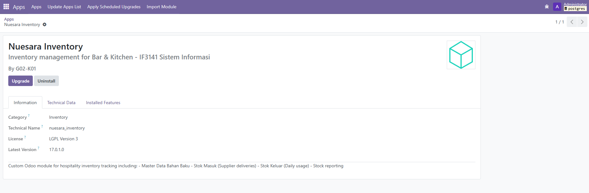

### 8. Coba akses sistem menggunakan role yang tersedia

Logout dari akun administrator, lalu login menggunakan salah satu kredensial role pada bagian berikutnya. Setiap role akan menampilkan menu yang berbeda sesuai hak aksesnya.

Expected result: pengguna dapat membuka menu **Nuesara Inventory** dengan fitur sesuai role masing-masing.

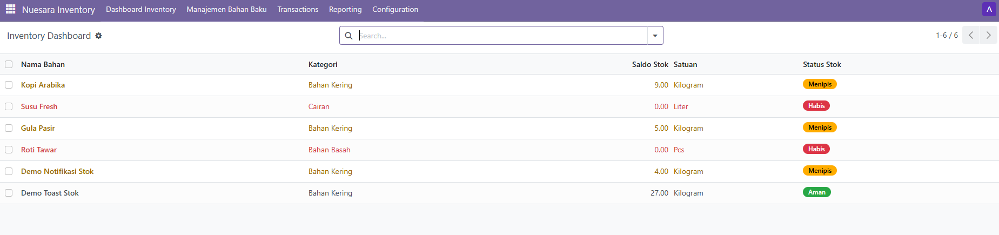

## Kredensial Pengguna

Kredensial berikut dibuat melalui data demo pada modul `nuesara_inventory` dan dapat digunakan untuk mencoba sistem berdasarkan role.

| Role | Nama Pengguna | Username | Password | Hak Akses Utama |
| --- | --- | --- | --- | --- |
| Admin | Nuesara Admin | `admin.nuesara` | `admin1123` | Mengelola master bahan baku, threshold, stok masuk, pemakaian harian, permintaan pengadaan, laporan, dan log aktivitas |
| Head Divisi | Nuesara Head Divisi | `head.nuesara` | `head1123` | Melihat dashboard inventory, mencatat stok masuk, dan membuat permintaan pengadaan |
| Staf Bar & Kitchen | Nuesara Staf Bar Kitchen | `staf.nuesara` | `staf1123` | Mencatat pemakaian harian bahan baku |
| Divisi Finance | Nuesara Finance | `finance.nuesara` | `finance1123` | Melihat laporan harian penggunaan bahan baku |
| Owner | Nuesara Owner | `owner.nuesara` | `owner1123` | Melihat laporan harian dan laporan bulanan |

## Struktur Direktori

| Path | Keterangan |
| --- | --- |
| `config/` | Konfigurasi Odoo |
| `custom_addons/nuesara_inventory/` | Modul utama Nuesara Inventory |
| `custom_addons/nuesara_inventory/models/` | Model bisnis sistem inventaris |
| `custom_addons/nuesara_inventory/views/` | Tampilan dan menu Odoo |
| `custom_addons/nuesara_inventory/security/` | Grup pengguna dan hak akses |
| `custom_addons/nuesara_inventory/data/` | Data demo pengguna dan data awal |
| `scripts/` | Script import dan export database |
| `dump/` | Lokasi file dump database |
| `docs/screenshots/` | Lokasi screenshot dokumentasi |

## Fitur Utama

1. Autentikasi dan pembagian akses berdasarkan role.
2. Pengelolaan master bahan baku.
3. Konfigurasi threshold minimum stok.
4. Dashboard status stok bahan baku.
5. Pencatatan stok masuk dari supplier.
6. Pencatatan pemakaian harian bahan baku.
7. Permintaan pengadaan bahan baku.
8. Notifikasi stok menipis atau habis.
9. Laporan harian dan bulanan penggunaan bahan baku.
10. Log aktivitas untuk kebutuhan audit.

## Database Migration

Matikan service terlebih dahulu sebelum melakukan export atau import database.

```bash
docker compose down
```

Export database:

```bash
scripts\export_db.cmd
```

Import database:

```bash
scripts\import_db.cmd
```

Untuk macOS atau Linux, gunakan script `.sh` yang tersedia pada folder `scripts`.

## Kesimpulan dan Saran

Nuesara Inventory berhasil mengimplementasikan sistem inventaris bahan baku yang mendukung proses operasional Nuesara Coffee & Habitual, mulai dari pencatatan stok, pemantauan kondisi bahan baku, permintaan pengadaan, hingga pelaporan. Pembagian role membuat sistem lebih sesuai dengan alur kerja perusahaan karena setiap pengguna mendapatkan akses berdasarkan tanggung jawabnya.

Ke depannya, sistem dapat dikembangkan dengan integrasi purchase order, pengiriman notifikasi melalui email atau aplikasi pesan, serta dashboard analitik yang lebih lengkap untuk membantu perusahaan memprediksi kebutuhan bahan baku berdasarkan tren pemakaian. Pengembangan tersebut dapat membuat sistem semakin bermanfaat untuk pengambilan keputusan operasional dan perencanaan pengadaan.
